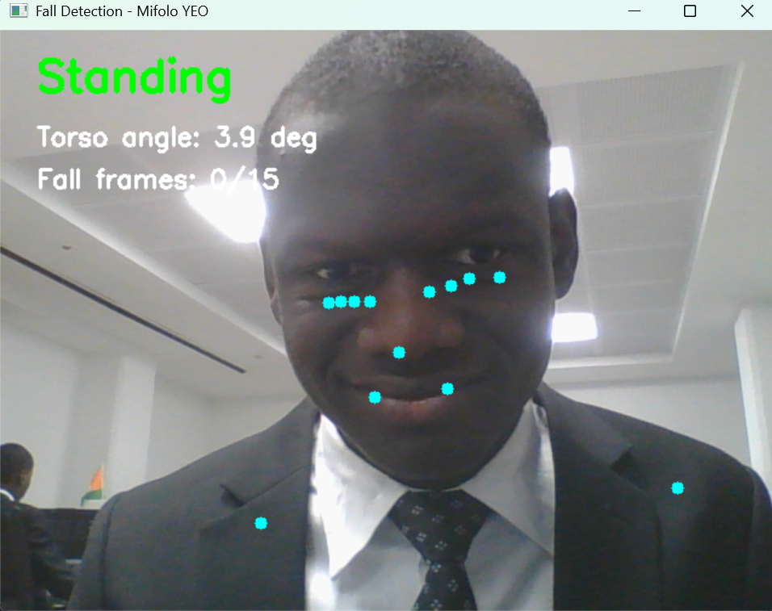

# Fall Detection System — Privacy-Preserving Edge AI

A real-time fall detection prototype for elderly people in smart homes, running entirely on-device (CPU-only) with no cloud dependency and no external data transmission.

Built as a proof-of-concept for research on **privacy-preserving edge inference** using lightweight pose estimation.

---

## Problem

Falls are the leading cause of injury-related death among people aged 65 and older. Existing automated detection systems often rely on cloud-based processing, raising serious privacy concerns when cameras are deployed in private living spaces.

This project explores a local, on-device alternative: detecting falls in real time using skeletal pose estimation, with zero sensitive visual data leaving the device.

---

## Method

- **Pose Estimation:** MediaPipe Pose Landmarker (Lite model) detects 33 body keypoints per frame
- **Torso Angle:** Computes the angle between the shoulder midpoint and hip midpoint relative to the vertical axis. A standing person has an angle near 0°; a fallen person exceeds 60°
- **Multi-frame Confirmation:** A fall is confirmed only after 15 consecutive frames above the threshold (~0.5 seconds), eliminating false positives from momentary bending
- **Fall Logging:** Every confirmed fall is automatically recorded in `fall_log.csv` with a timestamp
- **Inference:** Runs on CPU via TensorFlow Lite (embedded in MediaPipe) — no GPU required
- **Privacy:** All processing is local. No frames or keypoints are transmitted externally

---

## Architecture

Webcam Input
│
▼
MediaPipe Pose Landmarker (TFLite, CPU)
│
▼
Keypoint Extraction (shoulders, hips, ankles)
│
▼
Fall Detection Logic (vertical ratio threshold)
│
▼
Real-time Display (OpenCV) + Status Overlay

---

## Installation

**Requirements:** Python 3.10+

```bash
git clone https://github.com/mifolotech/fall-detection.git
cd fall-detection
python -m venv venv
venv\Scripts\activate        # Windows
pip install mediapipe opencv-python
```

---

## Usage

```bash
python fall_detection.py
```

- **Green — Standing:** person is upright
- **Red — FALL DETECTED:** person is horizontal or has collapsed
- Press **Q** to quit

---

## Current Limitations & Future Work

- Angle threshold fixed at 60°: works well in controlled environments, sensitive to camera angle and distance
- Next steps: adaptive threshold calibration per user, multi-person detection, alert system (sound/notification)
- Long-term goal: deploy on Raspberry Pi 4 for real smart home scenarios with always-on monitoring

---

## References

1. Lugaresi, C. et al. (2019). _MediaPipe: A Framework for Building Perception Pipelines_. arXiv:1906.08172
2. Rougier, C. et al. (2011). _Robust Video Surveillance for Fall Detection Based on Human Shape Deformation_. IEEE TCSVT, 21(5), 611–622
3. Chen, W. et al. (2020). _Fall Detection Based on Key Points of Human-Skeleton Using OpenPose_. Symmetry, 12(5), 744

---

## Author

**Mifolo YEO** — B.Sc. Computer Systems and Software, Jesuit University of Abidjan, Côte d'Ivoire

Research interest: Privacy-preserving real-time AI for elderly monitoring on resource-constrained edge devices
